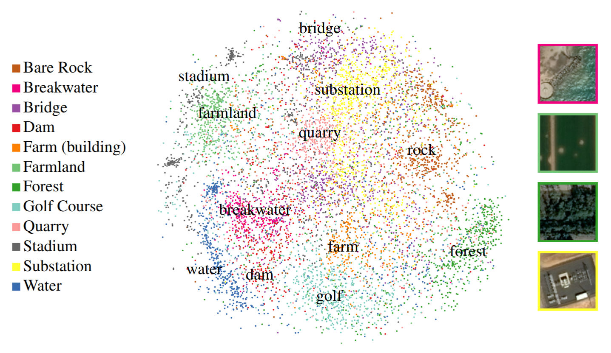

# Contrastive Sensor Fusion
Code implementing Contrastive Sensor Fusion, an approach for unsupervised learning of multi-sensor representations targeted at remote sensing imagery.

Check out our paper, ["Representation Learning for Remote Sensing: An Unsupervised Sensor Fusion Approach"](https://openreview.net/forum?id=HJx5PJxuwB).

# Datasets
Our OSM-labeled dataset can be found at https://storage.cloud.google.com/public-published-datasets/osm_example_dataset.zip?folder=true&organizationId=272688069953

# Configuration and Scripts
Training and experiments are all handled through runnable scripts in `csf/scripts/`.
To see the full configuration a script accepts, run `python3 csf/scripts/some_script.py --helpfull`.
To pass a set of configuration defined in a file, run `python3 csf/scripts/scripy.py --flagfile=csf/parameters/some_config_file.cfg`.

We handle configuration and flags with [abseil](https://github.com/abseil/abseil-py).
All configuration can be changed with command-line arguments or config files, but we've included the settings we used for the paper in `csf/parameters/`.

# Training
To train the model, use `csf/scripts/train_unsupervised.py`.
The training configuration used for the paper is in `csf/parameters/training.cfg`.

# Experiments
There are a number of experiments available to run, all configured with `csf/parameters/experiments.cfg`.
Experiments using a trained model should be passed `--checkpoint=some_checkpoint`.
`--experiment_bands` configures which bands are passed.

Experiments:
 - `csf/scripts/visualize_dataset.py`: Visualizes a dataset and the view-creation process. Does not require a trained model.
 - `csf/scripts/plot_representations.py`: Makes PCA and t-SNE plots of a model's representation of the OSM imagery.
 - `csf/scripts/plot_salient_images.py`: Finds key directions in representation space and the images that maximally activate them.
 - `csf/scripts/run_nearest_neighbor_experiment.py`: Runs the nearest-neighbor experiments discussed in our paper.

# Citation
TODO
